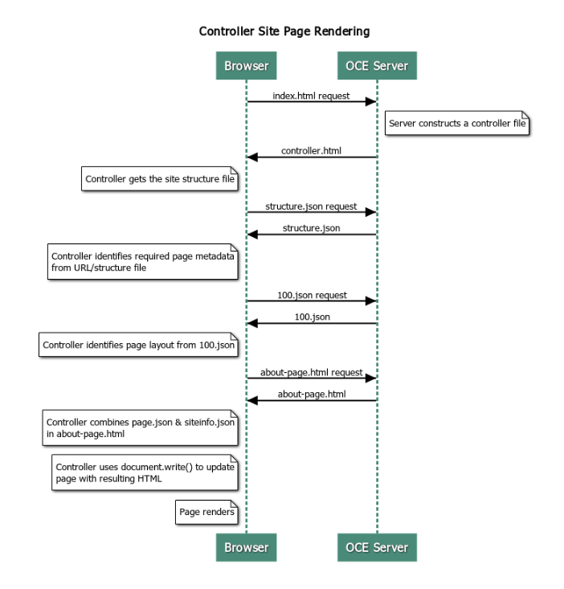
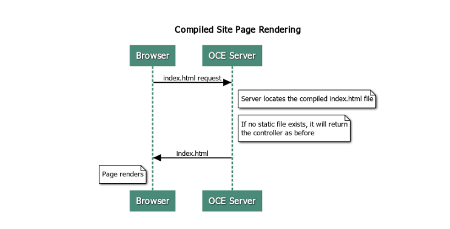

# Overview

## What is Compilation in OCM? 

The objective of OCM Compilation is to improve the runtime performance and behavior of OCM Sites pages. 

Compilation achieves this by creating a static .html file for each page in the site that will behave EXACTLY as the original page.  The meta-data files that constitute a sites "page" are combined during compile avoiding the server requests that are normally required at runtime.  You're effectively moving the per-page-view render cost to a one-off compile-time cost. 

Performance improvements are achieved by reducing the number of runtime requests. This can include avoiding all content queries since you can compile the results of these queries directly into the page. 

Behavioral improvements are achieved since the page will render immediately and you can therefore avoid issues such as "flash of un-styled content" or having components appear on the page in an indeterminate order - such as where the footer appears immediately and then moves down the page as the other items on the page render.

To compile the pages within an OCM site, you will need to export the site as a template and then use the Content Toolkit to compile the template and upload the static pages produced to the original site. The steps below walk you through template compilation process and then how to use this model to compile your sites.   

## Interaction with Prerender

Pre-render is focused on returning results suitable to a search engine. The pages produced by pre-render are NOT expected to run as the original page did and no JavaScript is executed - it simply returns the browser pre-rendered HTML to support SEO text search.  

The static pages created by Site Compilation, are expected to run in the browser and behave EXACTLY as the original dynamic sites page. This includes running non-compiled components dynamically and executing runtime queries where the user wants completely up to date data in the results rather than fixing the data at compile-time. 

When the Prerender solution is enabled by the tenant administrator, static pages may also be delivered via the Prerender Server.  This allows indexers and crawlers to handle portions of static pages that may still render dynamically, like content lists and recommendations.

OCM Controller Site Page Rendering

The "cec compile-template" command enables site pages to render directly in the browser without going OCM's site page controller.  Without using the compiler to create static .html pages, OCM Sites uses a controller model to render pages.  This involves a number of requests to get information about the site, the page within the site and templates used to render the page before it can actually display the page in the browser. 

#### Figure 1. Typical OCM site requests to render a page 

> Note:  There are more requests involved such as getting the controller.js file. This diagram simply provides an overview of the main phases. 



## OCM Compiled Site Page Rendering

The "cec compile-template" command allows you to compile all these steps into a static .html file and improves performance of 
runtime sites by reducing or eliminating these server requests.  In addition, you can further reduce requests for resources that need not change at runtime and have them compiled into the static pages. 

The default compilation process does the work of the existing runtime controller, creating a physical .html page for each page.json file in the site. These pages can then be deployed to the site and will be published with the site and used when the corresponding page URL is hit. 

#### Figure 2. Compiled OCM site page requests



## Template Compilation

To compile a site, you need to have access to the theme's and components within the site.  The OCM Sites Template is the packaging model for site.  It contains all the required resources in order to migrate and run the site and so is used to export the site to the Content Toolkit environment where the site within the template can be compiled.  

The following steps walk through the steps showing compilation of the site within the the BlogTemplate that is seeded in Content Toolkit.

### Setup

The "cec compile-template" command is available via the Content Toolkit and is installed when the toolkit is installed.  Follow the standard instructions for installing the Content Toolkit. 

Once you have the Content Toolkit installed, you can run the following command.  Note: The command is currently not listed when you display cec help. 

#### Install an Content Toolkit development directory

```
mkdir cec-src
cd ./cec-src
cec install

# Start up the CEC Toolkit Development server for testing
cec develop &
```

### Create the template

The seeded BlogTemplate has been updated with custom compilers, create a template from this source

```
# create a new template (must be in the cec-src folder if not already there)
cd ./cec-src
cec create-template BlogTemplate -f BlogTemplate
```

### About the template

The seeded "BlogTemplate" extends the previous template with custom compilers for:

* Content Layout Compilers

```
cec-src/src/components/Starter-Blog-Post-Summary/assets/compile.js
cec-src/src/components/Starter-Blog-Author-Summary/assets/compile.js
cec-src/src/components/Starter-Blog-Post-Content/assets/compile.js
cec-src/src/components/Starter-Blog-Post-Header/assets/compile.js
cec-src/src/components/Starter-Blog-Post-Sidebar/assets/compile.js
```

* Page Layout Compilers

```
cec-src/src/themes/BlogStarterTheme/layouts/post-detail-compile.js
cec-src/src/themes/BlogStarterTheme/layouts/home-compile.js
cec-src/src/themes/BlogStarterTheme/layouts/authors-compile.js
cec-src/src/themes/BlogStarterTheme/layouts/common-compile.js
cec-src/src/themes/BlogStarterTheme/layouts/about-compile.js
cec-src/src/themes/BlogStarterTheme/layouts/index-compile.js
```
### Compiling your Template

When you compile your template, it creates a static .html page for each of the pages in the structure.json file for the site within the template. The compilation step combines the page metadata (e.g.: 100.json) with the page layout (e.g.: about.html) so that you have a .html page that will immediately display without the need for a controller at runtime. 

The above custom compilers allow you to further reduce the runtime JavaScript execution by having previously dynamic items such as navigation and components compiled into the page. 

The `cec compile-template` command will do the following:

* For each page in the site
    * Read in the site and page meta-data
    * Read in the Page Layout and apply any page layout compiler
    * For each slot on the page
        * Expand the slot with the grid defined in the page.json file
        * For each component within the slot
            * Apply any component compiler
            * Insert the generated component markup in the corresponding location within the slot
        * Expand any macros in the compiled markup and insert the "SCS" JavaScript object that is used by the OCM renderer at runtime
        * Save the compiled page markup under the `src/templates/<template>/static` folder

To compile your site run: 

```
$ cec compile-template BlogTemplate 
Compile Template: compiling template BlogTemplate
Oracle Content Management Site Compiler
createPage: Processing pageId 100. Preview URL: http://localhost:8085/templates/BlogTemplate/index.html
createPage: Processing pageId 105. Preview URL: http://localhost:8085/templates/BlogTemplate/post-detail.html
createPage: Processing pageId 401. Preview URL: http://localhost:8085/templates/BlogTemplate/about.html
createPage: Processing pageId 402. Preview URL: http://localhost:8085/templates/BlogTemplate/search.html
createPage: Processing pageId 403. Preview URL: http://localhost:8085/templates/BlogTemplate/authors.html
All page creation calls complete.
Creating detail pages:
createPage: Processing detail pageId 105. Preview URL: http://localhost:8085/templates/BlogTemplate/post-detail/1481786063051-developing-content-layout-for-content-and-experience-cloud
createPage: Processing detail pageId 105. Preview URL: http://localhost:8085/templates/BlogTemplate/post-detail/1481786063052-dynamic-dom-manipulation-in-content-layout
createPage: Processing detail pageId 105. Preview URL: http://localhost:8085/templates/BlogTemplate/post-detail/1481786063045-getting-media-url-in-the-content-layout
createPage: Processing detail pageId 105. Preview URL: http://localhost:8085/templates/BlogTemplate/post-detail/1481786063053-getting-reference-items-in-content-layout
createPage: Processing detail pageId 105. Preview URL: http://localhost:8085/templates/BlogTemplate/post-detail/1481786063048-navigating-to-a-search-page-with-search-query
createPage: Processing detail pageId 105. Preview URL: http://localhost:8085/templates/BlogTemplate/post-detail/1481786063050-alex-read
createPage: Processing detail pageId 105. Preview URL: http://localhost:8085/templates/BlogTemplate/post-detail/1481786063047-jerrold-summers
createPage: Processing detail pageId 105. Preview URL: http://localhost:8085/templates/BlogTemplate/post-detail/1481786063049-kelly-emerson
createPage: Processing detail pageId 105. Preview URL: http://localhost:8085/templates/BlogTemplate/post-detail/1481786063043-samantha-howard
createPage: Processing detail pageId 105. Preview URL: http://localhost:8085/templates/BlogTemplate/post-detail/1481786063046-raising-triggers-from-content-layout
createPage: Processing detail pageId 105. Preview URL: http://localhost:8085/templates/BlogTemplate/post-detail/1481786063044-rendering-the-content-layout-using-mustache-template
All detail page creation calls complete.
Compilation completed with 0 errors and 3 warnings.
 to display warnings, run with --verbose (-v) option.
*** compiled template is ready to test
 *** to render non-compiled pages, remove compiled files from under: /private/tmp/cec-src/src/templates/BlogTemplate/static
```
#### Compilation Errors

During compile you will get three types of messages: 

1. Info:  These are items that you should be aware of but are probably expected as part of compilation. The sort of things that fall into this category are: 
    * placeholder content items that will render at runtime
    * missing page layout compilers, page layouts may not have any dynamic element and so aren't considered an issue if they are missing 
    * Items marked as "render on access" - i.e.: The site developer wants this component to be dynamically rendered at runtime even though the page is compiled
2. Warning: These will likely affect the performance of the running site and should be fixed where possible.  Items in this category are:
    * Missing content layout or custom component compilers - without these, the components will render dynamically into the page as they did previously
    * Missing content layout maps - it's unlikely you want to use the system default content layout to render content items
3. Errors: These indicate a compilation failure.  The pages will continue to compile where possible but the overall compilation will exit with error. 
    * This is most likely caused by JavaScript errors in custom compilers and must be resolved. 

> Note: To reduce repetitive messages, the same message will only appear once per compilation regardless of whether it occurs on multiple pages. 

In the above example there is the following compilation exit status:

```
Compilation completed with 0 errors and 3 warnings.
 to display warnings, run with --verbose (-v) option.
 If you re-run the compilation step with the "-v" option, you will see the following output: 
```

 If you re-run the compilation step with the "-v" option, you will see the following output: 

```
$ cec compile-template BlogTemplate --verbose
Compile Template: compiling template BlogTemplate
Oracle Content Management Site Compiler
createPage: Processing pageId 100. Preview URL: http://localhost:8085/templates/BlogTemplate/index.html
createPage: Processing pageId 105. Preview URL:
http://localhost:8085/templates/BlogTemplate/post-detail.html
 Info: no content item specified for placeholder: a890a65c-c0fc-451b-966b-e606ca18a1f4 component will render at runtime.
 Info: no content item specified for placeholder: c90bbc10-c9d8-4a54-8dd4-7a8251e8efbb component will render at runtime.
 Info: no content item specified for placeholder: f12691e1-79ab-4d1f-a8b9-3af8c638dd26 component will render at runtime.
createPage: Processing pageId 401. Preview URL: http://localhost:8085/templates/BlogTemplate/about.html
createPage: Processing pageId 402. Preview URL: http://localhost:8085/templates/BlogTemplate/search.html
Info: Component: "fdfd0392-e901-48f6-8044-36803c836aa1" of type "scs-contentlist" marked as "render on access", will not be compiled.
 Info: Component: "ba9f3711-4367-444e-ae38-71289fc10e73" of type "scs-contentlist" marked as "render on access", will not be compiled.
createPage: Processing pageId 403. Preview URL: http://localhost:8085/templates/BlogTemplate/authors.html
All page creation calls complete.
Creating detail pages:
createPage: Processing detail pageId 105. Preview URL: http://localhost:8085/templates/BlogTemplate/post-detail/1481786063051-developing-content-layout-for-content-and-experience-cloud
createPage: Processing detail pageId 105. Preview URL: http://localhost:8085/templates/BlogTemplate/post-detail/1481786063052-dynamic-dom-manipulation-in-content-layout
createPage: Processing detail pageId 105. Preview URL: http://localhost:8085/templates/BlogTemplate/post-detail/1481786063045-getting-media-url-in-the-content-layout
createPage: Processing detail pageId 105. Preview URL: http://localhost:8085/templates/BlogTemplate/post-detail/1481786063053-getting-reference-items-in-content-layout
createPage: Processing detail pageId 105. Preview URL: http://localhost:8085/templates/BlogTemplate/post-detail/1481786063048-navigating-to-a-search-page-with-search-query
createPage: Processing detail pageId 105. Preview URL: http://localhost:8085/templates/BlogTemplate/post-detail/1481786063050-alex-read
 Warning: failed to find content layout map entry for: Starter-Blog-Author:header. Will compile using the system default layout.
 Warning: failed to find content layout map entry for: Starter-Blog-Author:content. Will compile using the system default layout.
 Warning: failed to find content layout map entry for: Starter-Blog-Author:sidebar. Will compile using the system default layout.
createPage: Processing detail pageId 105. Preview URL: http://localhost:8085/templates/BlogTemplate/post-detail/1481786063047-jerrold-summers
createPage: Processing detail pageId 105. Preview URL: http://localhost:8085/templates/BlogTemplate/post-detail/1481786063049-kelly-emerson
createPage: Processing detail pageId 105. Preview URL: http://localhost:8085/templates/BlogTemplate/post-detail/1481786063043-samantha-howard
createPage: Processing detail pageId 105. Preview URL: http://localhost:8085/templates/BlogTemplate/post-detail/1481786063046-raising-triggers-from-content-layout
createPage: Processing detail pageId 105. Preview URL: http://localhost:8085/templates/BlogTemplate/post-detail/1481786063044-rendering-the-content-layout-using-mustache-template
All detail page creation calls complete.
Compilation completed with 0 errors and 3 warnings.
*** compiled template is ready to test
 *** to render non-compiled pages, remove compiled files from under: /private/tmp/cec-src/src/templates/BlogTemplate/static
```

#### Detail Page Compilation 

You'll notice that the above compilation output happens in two sections: 

1. Page Compilation
2. Detail Page Compilation

For detail page compilation, it collates all the content items it encounters during compilation and then re-compiles the detail page for each content item it finds using the slug value to define the URL to the new detail page. 

In the above example, you'll see warnings about no content layout maps entries for the "Starter-Blog-Author" page.  However, we don't want detail pages for the "Starter-Blog-Author", the detail page is only for "Starter-Blog-Post" content items. To remove these errors, we can exclude content items from detail page compilation if they don't have an explicit detail page referenced in their settings with the following option: 

```
--noDefaultDetailPageLink, -o  Do not generate compiled detail page for items/content lists that use the default detail page
```

So, re-running compilation excluding detail page creation that use the "default detail page", produces the following output: 

```
> cec compile-template BlogTemplate --noDefaultDetailPageLink
Compile Template: compiling template BlogTemplate
Oracle Content Management Site Compiler
createPage: Processing pageId 100. Preview URL: http://localhost:8085/templates/BlogTemplate/index.html
createPage: Processing pageId 105. Preview URL: http://localhost:8085/templates/BlogTemplate/post-detail.html
createPage: Processing pageId 401. Preview URL: http://localhost:8085/templates/BlogTemplate/about.html
createPage: Processing pageId 402. Preview URL: http://localhost:8085/templates/BlogTemplate/search.html
createPage: Processing pageId 403. Preview URL: http://localhost:8085/templates/BlogTemplate/authors.html
All page creation calls complete.
Creating detail pages:
createPage: Processing detail pageId 105. Preview URL: http://localhost:8085/templates/BlogTemplate/post-detail/1481786063051-developing-content-layout-for-content-and-experience-cloud
createPage: Processing detail pageId 105. Preview URL: http://localhost:8085/templates/BlogTemplate/post-detail/1481786063052-dynamic-dom-manipulation-in-content-layout
createPage: Processing detail pageId 105. Preview URL: http://localhost:8085/templates/BlogTemplate/post-detail/1481786063045-getting-media-url-in-the-content-layout
createPage: Processing detail pageId 105. Preview URL: http://localhost:8085/templates/BlogTemplate/post-detail/1481786063053-getting-reference-items-in-content-layout
createPage: Processing detail pageId 105. Preview URL: http://localhost:8085/templates/BlogTemplate/post-detail/1481786063048-navigating-to-a-search-page-with-search-query
All detail page creation calls complete.
Compilation completed with no errors.
*** compiled template is ready to test
 *** to render non-compiled pages, remove compiled files from under: /private/tmp/cec-src/src/templates/BlogTemplate/static
```

#### Compiling Specific Pages

You need not compile all the pages in the template and can selectively choose which pages to compile. This is useful if you are working on specific pages that you want to debug or update rather than having to continually re-compile the entire site. 

To compile specific pages use the --pages (-p) option followed by the list of pages you're interested in compiling. 
> Note: If content items on the pages in the list reference detail pages, the detail pages will also be compiled even thought they aren't explicitly included. 

```
$ cec compile-template BlogTemplate --pages 401,402
Compile Template: compiling template BlogTemplate
Oracle Content Management Site Compiler
createPage: Processing pageId 401. Preview URL: http://localhost:8085/templates/BlogTemplate/about.html
createPage: Processing pageId 402. Preview URL: http://localhost:8085/templates/BlogTemplate/search.html
All page creation calls complete.
Compilation completed with no errors.
*** compiled template is ready to test
 *** to render non-compiled pages, remove compiled files from under: /private/tmp/cec-src/src/templates/BlogTemplate/static
```

## Site Compilation

The above steps give you an overview of how to create and compile a local template.  In general, you will be compiling your actual OCM sites. 

To compile an OCM site, you need to export the site into a template and then compile the template. The template package will have the site as well as any custom code required to compile the site in the themes and components that are exported with the template. 

### Pre-requisites

The following steps assume that you've created a site called BlogSite in your OCM server. You can upload the above BlogTemplate and then create this site from the template. 

e.g.: 

```
$ cec upload-template BlogTemplate --sever UAT  
> cec create-site BlogSite --template BlogTemplate --repository <yourRepository> --localizationPolicy <yourLocalizationPolicy> --defaultLanguage en-US --server UAT
```

Once you've selected or created your site, you can follow the steps below to compile your site. 

### Compiling a Site

#### Create a Template from your Site

```
$ cec create-template-from-site
Options:
 --site, -s <site> Site to create from [required]
 --includeunpublishedassets, -i flag to indicate to include unpublished content items and digital assets in your template
 --server, -r <server> The registered CEC server
 --help, -h Show help [boolean]

$ cec create-template-from-site BlogTemplate --site BlogSite --includeunpublishedassets --server UAT
Download your Template
$ cec download-template BlogTemplate --server UAT
```

#### Compile your Template

```
$ cec compile-template BlogTemplate --noDefaultDetailPageLink --verbose --server UAT --channelToken e1bb88cdc1e025c8dd278f6b676877a3
```

> Note: You will need to get the --channelToken (-c) for you site in the server for the site's publishing channel.  This will then be used for all the queries within the site in your template.

#### Upload Compiled Site Pages

Copy the compiled static files into the static folder for the site:

```
$ cec upload-static-site src/templates/BlogTemplate/static --site BlogSite --server UAT
```

#### Revert to Non-compiled Behavior

To revert to non-compiled behavior, you need to remove the static files that you uploaded into the site:

```
$ cec delete-static-site BlogSite --server UAT
```

And, if the site is currently published, re-publish the site. 

> Note: This simply removes the "static" folder from the site, it doesn't remove the site. 

## Custom Compilers

The compilation process can be further enhanced with "custom compilers".  

Custom compilers are called to allow the site developer to compile the "page layout", "section layout", "custom component" or "content layout" into the page and avoid the need for the component to be added dynamically at runtime.  If no custom compiler exists for a component or the component compiler returns no markup, then the component will be rendered at runtime as if it was never compiled. 

Custom compilers are supported for: 

* Page Layouts
* Section Layouts
* Custom Components
* Content Layouts

The samples below show a "Page Layout" and a "Content Layout" compiler.  "Section Layout" and "Custom Components" follow the same model as the "Content Layout" compiler. 

If no "custom compiler" exists, the component will render as it does today via the components render.js file. 

If a custom compiler does exist, it will be called and the resulting HTML inserted into the page.  The custom compiler can also indicate that the component needs JavaScript "hydration" at runtime.  If this is the case, the component's hydrate() function within the render.js file will be called.  If the component doesn't require hydration, then the component's render.js file is never loaded. 

> Note: Compilation is a runtime (published site) only feature.  When a site is viewed in edit/navigate/preview modes, the pages work as they do today and all components will always be dynamically added to the page.

### Constraints

The `cec compile-template` is a NodeJS application and runs outside of any browser.  Since the page is not rendered in a browser, there is no DOM or window object and client-side JavaScript libraries such as JQuery, VueJS, KnockoutJS, ... will not work.  While it is possible to use a library such as JSDOM to create a DOM object and run these client-side libraries, there is little advantage in doing so.  For simple HTML parsing, you can use a NodeJS HTML parser such as "cheerio". 

The HTML returned by the markup needs to be valid HTML. It will be passed through a parser and only the parsed HTML will be added to the page.  This is to confirm that the compiled HTML doesn't have mis-matched tags that could break slots. 

### Debugging Custom Compilers

When developing custom compilers, you will need to debug your code.  The "cec compile-template" command comes with a `--debug (-d)` option that will start up the compiler with the `--inspect-brk` flag set so that a debugger can be attached to the process. You can then follow standard node debugging to check your code. 

```
$ cec compile-template BlogTemplate --noDefaultDetailPageLink --debug
Debugger listening on ws://127.0.0.1:9229/8a8eba83-42d2-476b-adc1-b29ab4e92642
For help see https://nodejs.org/en/docs/inspector
```

In addition, you can use the `--pages (-p)` option to limit the pages that will be compiled to a specific page. 

### Page Layout Compilers

A Page Layout Compiler is a NodeJS (CommonJS) JavaScript module that compiles the corresponding Page Layout. 

The Page Layout Compiler for a specific Page Layout is defined by name association with a "-compile.js" extension:
* src
    * themes
        * <yourTheme>
            * layouts
                * <yourPageLayout>.html
                * <yourPageLayout>-compile.js

If no `<yourPageLayout>-compile.js` exists for a page layout then no custom compilation is applied. 

A page layout compiler needs to implement a `compile()` interface, which returns a `Promise`.  e.g.:  `about-compile.js`: 

```
var mustache = require('mustache');

var PageCompiler = function () {};

PageCompiler.prototype.compile = function (args) {
    var self = this,
        layoutMarkup = args.layoutMarkup;

    self.SCSCompileAPI = args.SCSCompileAPI;

    return new Promise(function (resolve, reject) {
        var compiledPage = layoutMarkup,
            id = self.SCSCompileAPI.navigationRoot;

        // page is compiled so there is no FOUC, can remove the opacity workaround
        compiledPage = compiledPage.replace('opacity: 0;', 'opacity: 1;');

        // remove the dynamic menu creation, we'll be compiling it here
        compiledPage = compiledPage.replace('<script src="_scs_theme_root_/assets/js/topnav.js"></script>', '');

        // add link to Home page...
        var homePageURL = (self.SCSCompileAPI.getPageLinkData(id) || {}).href;
        if (homePageURL) {
            compiledPage = compiledPage.replace('class="navbar-brand" href="#"', 'class="navbar-brand" href="' + homePageURL + '"');
        }

        // build the menu and add it to the page
        var navMenu = self.createNavMenu();
        compiledPage = compiledPage.replace('<!-- navigation menu goes in here -->', navMenu);

        // return the compiled page
        resolve(compiledPage);
    });
};

// Create the navigation menu that was previously dynamically generated on each page
PageCompiler.prototype.createNavMenu = function () {
....
}


module.exports = new PageCompiler();
```

### Component Compilers

Custom Component Compilers all follow the same model and can be created for:

* section layouts
* custom components
* content layouts

During compile, the cec compile-template command will look for a "compile.js" file in the same location as the "render.js" for the component:

* src
    * components
        * <yourComponent>
            * assets
                * render.js
                * compile.js

If this file doesn't exist, the component is not compiled and will be rendered at runtime.

If the file does exist, it needs to implement a `compile()` interface, which returns a Promise.  e.g.: The following "Starter-Blog-Author-Summary" is a Custom Content Layout compiler: 

```
var fs = require('fs'),
    path = require('path'),
    mustache = require('mustache');

var ContentLayout = function (params) {
    this.contentClient = params.contentClient;
    this.contentItemData = params.contentItemData || {};
    this.scsData = params.scsData;
};

ContentLayout.prototype = {
    contentVersion: '>=1.0.0 <2.0.0',

    compile: function () {
        var compiledContent = '',
            content = JSON.parse(JSON.stringify(this.contentItemData)),
            contentClient = this.contentClient;

        // Store the id
        content.fields.author_id = content.id;

        if (this.scsData) {
            content.scsData = this.scsData;
            contentType = content.scsData.showPublishedContent === true ? 'published' : 'draft';
            secureContent = content.scsData.secureContent;
        }

        // calculate the hydrate data
        content.hydrateData = JSON.stringify({
            contentId: content.id,
            authorName: content.fields['starter-blog-author_name']
        });

        try {
            // add in style - possible to add to <head> but inline for simplicity
            var templateStyle = fs.readFileSync(path.join(__dirname, 'design.css'), 'utf8');
            content.style = '<style>' + templateStyle + '</style>';

            var templateHtml = fs.readFileSync(path.join(__dirname, 'layout.html'), 'utf8');
            compiledContent = mustache.render(templateHtml, content);
        } catch (e) {
            console.error(e.stack);
        }

        return Promise.resolve({
            content: compiledContent,
            hydrate: true // note that we want to hydrate this component using the render.js hydrate() function. This is required for when the user clicks on the author
        });
    }
};

module.exports = ContentLayout;
```

### SCSCompileAPI

Similar to the SCSRenderAPI, there is an SCSCompileAPI that is passed in to each compile function. 

This contains:

* Properties:
    * navigationRoot: The ID of the node that is the root of the site.
    * navigationCurr: The ID of the current page node.
    * structureMap: All of the nodes of the site hierarchy and accessed by ID. 
    * siteInfo: All the site properties.
* Functions:
    * getContentClient: Gets the contentClient instance for use in Content API calls. 

### Component Hydration

Hydration refers to the process of adding back in the JavaScript behavior to the compiled HTML in the page when the HTML renders in the browser. 

For example, if you have two components on the page that you want to render as master/detail, then clicking on an item in the master needs to update the detail component.  This is all handled by JavaScript that executes in the page.  To make this work, you need to "hydrate" the two components HTML after they've rendered into the page by adding an "on click" event handler to the elements in the master component and a listener on the detail component container to re-render when the "on click" event occurs based on the payload passed in the event.  

Component compilers insert HTML into the page.  If your component needs additional JavaScript to be executed at runtime to add in things like event handlers, then you have a couple of options. Which solution you choose depends on your requirements. 

#### Inline JavaScript

You can insert a `<script>` tag directly into the returned compiled markup, which will execute as the page executes. e.g.:

```
<script src="/_sitesclouddelivery/renderer/libs/scs-core/jssor-slider/js/jssor.slider.min.js" type="text/javascript"></script>
<div id="slider_container_c46b122d-978a-429d-aa25-9b5698428f6f" style="position: relative; top: 0px; left: 0px; height: 400px; width: 600px; background-color: rgb(68, 68, 68); visibility: visible;" data-jssor-slider="1">
...
</div>
<script>
        (function () {
            // get the required options
            var options = {"$FillMode":2,"$AutoPlay":false,"$AutoPlayInterval":3000,"$SlideDuration":500,"$ArrowKeyNavigation":true,"$HWA":false,"$BulletNavigatorOptions":{"$ChanceToShow":1,"$AutoCenter":1,"$SpacingX":5},"$ArrowNavigatorOptions":{"$ChanceToShow":1,"$AutoCenter":2,"$Steps":1},"$ThumbnailNavigatorOptions":{"$ChanceToShow":0,"$DisplayPieces":7,"$SpacingX":8,"$ParkingPosition":240}};
 
            // select the JSSOR value options
            options.$BulletNavigatorOptions.$Class = $JssorBulletNavigator$;
            options.$ArrowNavigatorOptions.$Class = $JssorArrowNavigator$;
            options.$ThumbnailNavigatorOptions.$Class = $JssorThumbnailNavigator$;
 
            // create the slider
            var slider = new $JssorSlider$("slider_container_c46b122d-978a-429d-aa25-9b5698428f6f", options);
 
            // resize, maintaining aspect ratio
            var container = slider.$Elmt.parentElement;
            if (container) {
                slider.$ScaleWidth(container.getBoundingClientRect().width);
            }
        })();
    </script>
```

#### Hydrate Function

Instead of in-lining the JavaScript, you can include a hydrate function in your render.js file and note that the component requires "hydration" at runtime when you return the compiled markup. This avoids repetitious <script> tags as well as enabling you to leverage existing JavaScript code to managing eventing. 

> Note: Even though the render.js file is loaded, the render() function is NOT called during hydrate, only the hydrate() function is called. 

> Note: If a compiled component does not say it needs hydration, then the component's render.js file is never loaded. 

e.g.:  Custom Content Layout Compiler would return with - `{ hydrate: true }`

```
        return Promise.resolve({
            content: compiledContent,
            hydrate: true // note that we want to hydrate this component using the render.js hydrate() function. This is required for when the user clicks on the author
        });
```

In addition, if required, the custom compiler can add "hydrate" properties that it will look for at runtime.  e..g: 

```
Compiler: 
        // calculate the hydrate data
        content.hydrateData = JSON.stringify({
            contentId: content.id,
            authorName: content.fields['starter-blog-author_name']
        });
....


Template: 
<div class="author-container" data-hydrate="{{hydrateData}}">
```

Finally, if a component notes that it needs hydration then, at runtime, the component's render.js file will be loaded and the `hydrate()` function called passing in the container `<div>` that contains the compiled markup.

e.g.: render.js - see `hydrate()` function:

```
    function selectAuthor(parentObj, contentId, authorName) {
        var $parentObj = $(parentObj);
        $parentObj.find(".author-name").click($.proxy(function () {
            $(".author-name").removeClass('author-selected');
            $(event.target).addClass('author-selected');
        }, self));
        if (window.location.href.indexOf("default=" + contentId) >= 0) {
            $(".author-name").each(function () {
                if (this.innerText === authorName) {
                    $(this).addClass('author-selected');
                }
            });
        }
    }
    ....


        hydrate: function (parentObj) {
            var $parentObj = $(parentObj),
                hydrateData = $parentObj.find('.author-container').attr('data-hydrate');
            if (hydrateData) {
                var data = JSON.parse(hydrateData);
                selectAuthor(parentObj, data.contentId, data.authorName);
            }
        },
        render: function (parentObj) {
        .....
            try {
                // Mustache
                template = Mustache.render(templateHtml, content);

                if (template) {
                    $(parentObj).append(template);
                }
                selectAuthor(parentObj, this.contentItemData.id, content.fields['starter-blog-author_name']);
            } catch (e) {
                console.error(e.stack);
            }
        }
```

## To Compile or not to Compile

In the 19.4.3. release, compilation is controlled by the developer.  However, the knowledge worker may want to choose which components on the page need to be compiled. They may wish to do this since they want the content query to always be updated with the latest results rather than being fixed at compile time.  This still allows the page to be compiled and gain runtime performance even if the dynamic components need to load after querying back the results. 

By default, all components will be compiled when the site is compiled, however the following components won't be compiled: 

* The Content List component that has specified "pagination"
* Any custom component or content layout that doesn't have a corresponding custom compiler
* Components that are iframed into the page 

Since compilation is controlled by the developer, the developer can still control whether a component should be compiled in the custom compilers.  The developer does this by checking details about the component and can then choose to return no output (e.g.: an empty string). Since a custom compiler that doesn't return any content will cause the component to be rendered dynamically at runtime.  

For example, if you have a content layout compiler, you can register this content layout twice in the content layout map: 

* Static Summary => myContentLayout
* Dynamic Summary => myContentLayout

The knowledge worker can then choose between "Static Summary" or "Dynamic Summary" depending on their use-case. 

The developer can then check against the "scsData.contentLayoutCategory" property that is passed in on create and then, during the compile() call, return an empty string if "scsData.contentLayoutCategory === 'Dynamic Summary'". 

## Publishing

After compiled static pages have been generated and uploaded to the static folder in the site, the site needs to be published or re-published for those to become active.  Similarly, to revert to non-compiled site delivery behavior, the site needs to be published or re-published after removing the static files from the site.

During publishing the uploaded static pages are made available for delivery.  Since these files are copied during the publishing process, the performance of the publish operation may decrease proportionally to the number of files.

The publishing operation takes the current set of static files and makes them available for delivery.  These files may or may not be in sync with any changes that have happened in the dynamic site, and may or may not mirror the dynamic site.  Updating the static files collection at appropriate times is left to the site developer.

### Static Site Delivery

#### Delivery Precedence

When a site has associated static files, those files are delivered for matching URLs coming into the server.  If an incoming URL does not match a static file, then the site's controller.html file is returned for the request.  (This follows the existing dynamic model for site delivery.)

OCM Sites can also define 301 and 302 redirects through an associated JSON file.  When redirects have been configured these take priority over static files.  Thus, if a URL matches both a redirect rule and a static file, the redirect will be delivered from the server.

The URL evaluation for site delivery follows this flow:

1. Does the URL match a configured redirect?  If so, issue a redirect response.
2. Does the URL correspond to a static file?  If so, deliver the static file.
3. Otherwise, deliver the dynamic site controller.html file.

#### Caching Headers

HTTP Headers in the responses from web servers help to determine how browsers will cache pages.  Static pages are also delivered with caching headers to help facilitate browser caching.  For secure sites, the following headers will be sent with responses:

```
Cache-Control: no-store
Pragma: no-cache
```

For standard, non-secure sites, the following headers will be sent:

```
Cache-Control: max-age=300
Edge-Control: !no-store,max-age=2592000,downstream-ttl=1800
The Edge-Control header helps to facilitate CDN caching behavior.
```

#### Detail Pages

Detail pages in OCM sites allow a single page to show information for a number of Content Items.  For example, the same detail page may be used to handle the following URLs: /detail/item1.html, /detail/item2.html, and /detail/item3.html.  Each of these URLs would display the same page structure, but show the content related to the Content Items whose slug values are item1.html, item2.html, and item3.html, respectively.  For this situation the cec template compiler might create four files:

* /detail/item1.html
* /detail/item2.html
* /detail/item3.html
* /detail.html

The final file allows newly published material to be displayed in the web site without having to recompile and republish the site.  In this example, perhaps a Content Item with slug value "item4.html" is published after the site is online.  The static "/detail.html" page allows that new item to be displayed dynamically in the site.  The URL "/detail/item4.html" would deliver the "detail.html" page but show content related to "item4.html" Content Item.

The cec compiler generates the "detail.html" page assuming that it will be used to display content items.  For this reason relative URLs inside the compiled "detail.html" page will have extra parent segments ("../").  Thus, if referenced directly, the "detail.html" page itself will not display properly.  The detail.html page itself should not be referenced or added to page navigation for this reason.

## Site Lifecycle and Compiled Pages

When you create a template from a site, compiled pages are not included in the template.  This is to avoid the issue where the static pages are being delivered when the site developer expected the dynamic pages to be delivered.  Therefore, if you subsequently create a site from the template, you will need to compile the site pages and upload them to the new site. 
